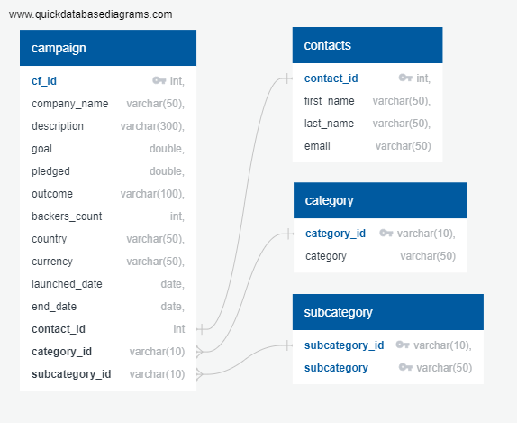

# Welcome to The Crowd Funding ETL Mini Project!

# Crowd Funding ETL: 
For the Crowd Funding ETL Mini Project, we have collaborated in a group of three team members and built an ETL pipeline using Python, Pandas, and Python dictionary methods / regular expressions to extract and transform the data. After Transforming  the data, we created four CSV files and used them  to create an ERD and a table schema. Finally, we uploaded the CSV file's data into a Postgres database joining all the databases into a "Flat File".

# The Team / Contributors: 
    - Minh Phuong Nguyen
    - Pedro Azpurua
    - Andrew Fellowes

# Repository and Documents: 

- Resources Folder: 

    - Containing the initial two xlsx files  
        - crowdfunding.xlsx
        - contacts.xlsx
    
    - Additional four CSV files created throught the ETL Process Including: 
        - categories.csv
        - subcategories.csv
        - campaign.csv
        - contacts.csv

- .gitignore file

- Crowd_Funding_Schema_ERD.png --> File contains a visual representaiton of the final schema built on QuickDBD 

    
- 1.Crowd_Funding_Schema_ERD.png --> Crowd_Fudning_Sql_Schema_File1.sql --> This SQL File contains the actual Schema used on Postgres to create the data tables which where later manually uploaded with the CSV Files created throughout the analysis located in the Resources Folder.

- 2.Crowd_Funding_Sql_Extra_Info.sql --> File contains the SQL Code to check all the four tables were loaded correctly and create one final Masterfile merging all the data tables together. FOr this to run, we need to run section by section.

- 3.Crowd_Funding_Schema_QuickDBD.sql --> Near Duplicate from the sql_schema file 1. Contains the code exported from QuickDBD. 

- Results Folder:  Based on the Postgres Query listed above, a Flat File was created to demonstrate all the elements ran successfully. 

# Core Tasks: 
- Section 1: Creating the Category and Subcategory DataFrames
- Section 2: The Campaign DataFrame
- Section 3: Create the Contacts DataFrame
- Section 4: Create the Crowdfunding Database

# Section 1: Creating the Category and Subcategory DataFrames
A Category DataFrame was created in order to replace the 9 variable categories and index them accordingly. As a key learning, this is what corporations would use to protect private data in a separate file. 
- Refer to category.csv (Resources Folder)

# Section 2: Section 2: The Campaign DataFrame
A Subcategory DataFrame was also created in the same maner as the categories one above. THis consisted of 24 unique variables.
- Refer to subcategory.csv (Resources Folder)

# Section 3: Create the Contacts DataFrame
For this section we we given the choice to clean the data with PamPandas tools or by using Regular Expressions (REGEX). 
- As a team, we collectiviley attempted this taks using a range of methods including: 
    1. Mapping the JSON data
    2. Parsing and Appending the Data
    3. Regex Functions

# Section 4: Create the Crowdfunding Database
Task 1: Created a schema with appropiate Forward and Primary Keys Using QuickDBD (https://www.quickdatabasediagrams.com/)

Once all the Relationships (1:1 or 1:Many) were created we exported the code into Postgres. All the created CSV Files (Databases) were manually loaded into each respective table (Following the Crowd_Funding_Schema_ERD.png). 

We later ensured all the data was successfully imported by running the SQL code in the extra info file (Crowd_Funding_Sql_Extra_Info). 

This code also allowed us to join all the different data tables into a "Masterfile" displaying how the queries ran successfully. (Refer to Results folder containing the crowdfunding_db.csv file)
